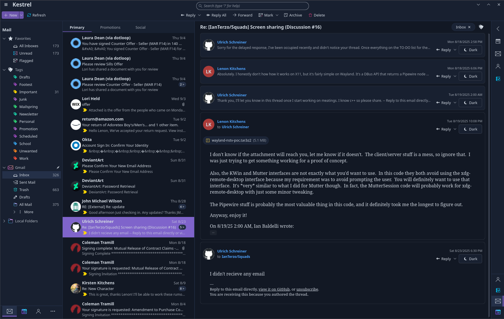
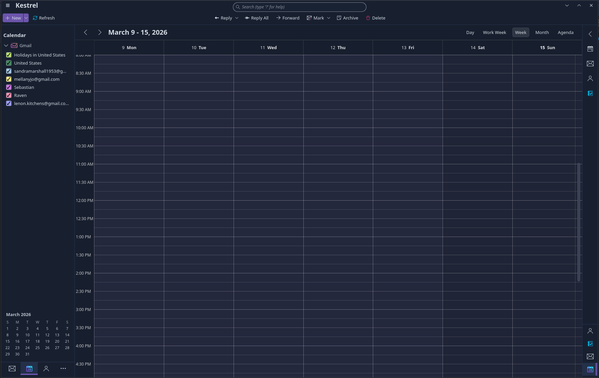
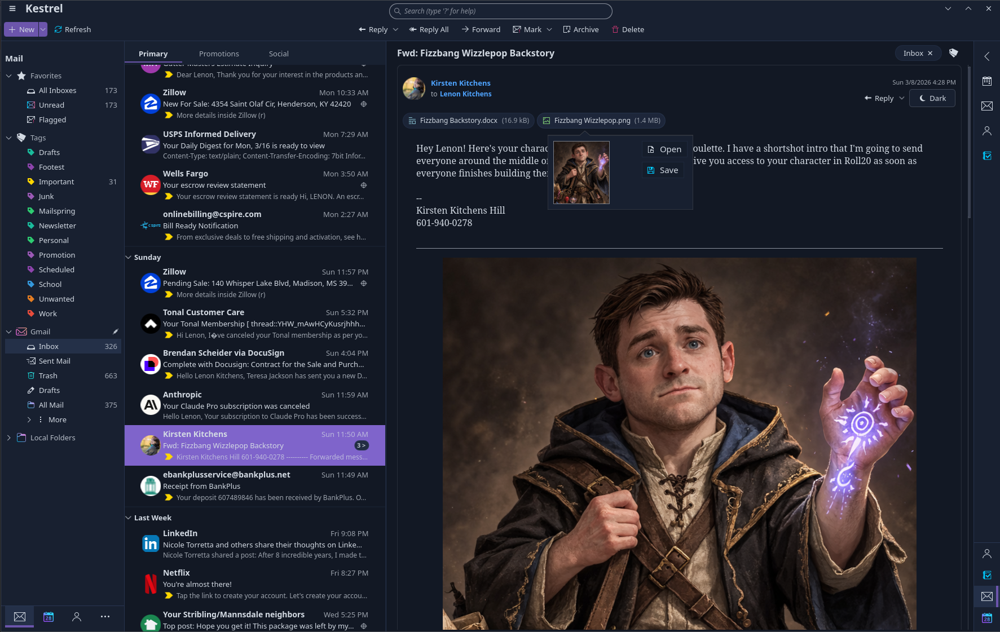

# Kestrel Mail

> ⚠️ **Pre-alpha / heavy development:** Kestrel Mail is currently under heavy development and is **not usable for normal day-to-day email yet**.

Kestrel Mail is a KDE-native email client focused on modern UX, reliable IMAP sync, and OAuth2-first account setup.

## Vision

- Beautiful tri-pane interface inspired by desktop-first mail clients
- KDE-first UX with Kirigami
- Reliable IMAP core with incremental sync and local persistence
- OAuth2-driven account setup for major providers

## Current Status

Kestrel is now past pure scaffold stage and has active end-to-end mail plumbing in place:

- Qt 6 + Kirigami app shell with split-pane mail layout
- Real Gmail OAuth2 flow (XOAUTH2 over IMAP)
- Folder discovery + persistence in SQLite
- Background folder refresh worker
- Folder-scoped sync path for message headers and flags
- Local folders + sidebar hierarchy (including collapsible **More** subtree)
- Message list and detail panes under active iteration

Still pre-alpha: expect rough edges, missing flows, and frequent schema/UI changes.

## Tech Stack

- Qt 6 + QML
- KDE Kirigami
- C++20 backend
- SQLite
- OAuth2 (PKCE)

## OAuth Setup (Gmail / Microsoft 365)

Configure provider OAuth client credentials in provider profile/account settings.
Environment-variable based OAuth client configuration is intentionally not supported.

## Build

```bash
cmake -S . -B build -DCMAKE_BUILD_TYPE=Debug
cmake --build build
./build/kestrel-mail
```

## Screenshots

### Mail workspace



### Calendar workspace



### Sidebar / folders view



### Demo screencast


## License

GPL-3.0-or-later
